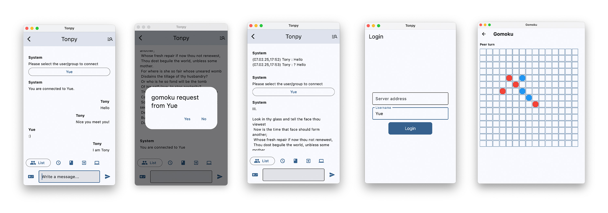

# Tonpy - A Python Chat Application


![Flet](https://img.shields.io/badge/Flet-FFFFFF?logo=data:image/svg+xml;base64,PD94bWwgdmVyc2lvbj0iMS4wIiBlbmNvZGluZz0iVVRGLTgiPz4KPCFET0NUWVBFIHN2ZyBQVUJMSUMgIi0vL1czQy8vRFREIFNWRyAxLjEvL0VOIiAiaHR0cDovL3d3dy53My5vcmcvR3JhcGhpY3MvU1ZHLzEuMS9EVEQvc3ZnMTEuZHRkIj4KPCEtLSBDcmVhdG9yOiBDb3JlbERSQVcgMjAxNyAtLT4KPHN2ZyB4bWxucz0iaHR0cDovL3d3dy53My5vcmcvMjAwMC9zdmciIHhtbDpzcGFjZT0icHJlc2VydmUiIHdpZHRoPSIzMDdweCIgaGVpZ2h0PSIzMDdweCIgdmVyc2lvbj0iMS4xIiBzaGFwZS1yZW5kZXJpbmc9Imdlb21ldHJpY1ByZWNpc2lvbiIgdGV4dC1yZW5kZXJpbmc9Imdlb21ldHJpY1ByZWNpc2lvbiIgaW1hZ2UtcmVuZGVyaW5nPSJvcHRpbWl6ZVF1YWxpdHkiIGZpbGwtcnVsZT0iZXZlbm9kZCIgY2xpcC1ydWxlPSJldmVub2RkIgp2aWV3Qm94PSIwIDAgMjg1IDI4NSIKIHhtbG5zOnhsaW5rPSJodHRwOi8vd3d3LnczLm9yZy8xOTk5L3hsaW5rIj4KIDxnIGlkPSJMYXllcl94MDAyMF8xIj4KICA8bWV0YWRhdGEgaWQ9IkNvcmVsQ29ycElEXzBDb3JlbC1MYXllciIvPgogIDxyZWN0IGZpbGw9Im5vbmUiIHdpZHRoPSIyODUiIGhlaWdodD0iMjg1IiByeD0iOS4wMyIgcnk9IjguMTIiLz4KICA8cGF0aCBmaWxsPSIjRUUzMTY3IiBkPSJNMzkuMjggMTQ0Ljc0Yy0wLjg1LC0xLjUyIC0wLjY2LC0yLjYxIDAuMSwtNC4xMyAzMS40MSwtNTguMzYgNzguODEsLTk0LjE1IDEzOC41MywtMTE5Ljc1IDIuMDMsLTAuODYgNS4wNCwxLjUyIDQuMzEsMy42NSAtOC45LDI1LjkxIC0xNS4xOCw1MS4xMyAtMTguODIsNzguMjMgLTMuMzIsMjQuOTcgLTQuMjQsNTAuNzkgLTAuODcsNzcuNzcgMy41NiwzMC41OSAxMC44OCw1NS45OSAxOS42OCw4My4zNiAwLjk4LDMuMDUgLTIuMTQsNC40MyAtNC41MSwzLjI2IC02Mi4xOSwtMzAuNjEgLTEwOS4zMywtNzAuNjUgLTEzOC40MiwtMTIyLjM5eiIvPgogIDxwYXRoIGZpbGw9IiMwMDk4REEiIGZpbGwtb3BhY2l0eT0iMC42MzkyMTYiIGQ9Ik0yMjQuNTMgMTk4LjU5Yy0zNC4zOSwtMTAuNzkgLTY1LjE1LC0yOS4wNiAtOTIuNCwtNTMuMiAtMS44MiwtMS42MiAtMS42MSwtMy44NyAwLjAzLC01LjQ0IDI3LjA3LC0yNS44OCA1Ny43OSwtNDYuMTkgOTEuNzQsLTYwLjU2IDIuOTksLTEuMjcgNS40NSwxLjIgNC41Niw0LjYyIC05LjYyLDM2LjkxIC0xMS43NCw3My4zOSAwLjEzLDEwOS45NSAwLjk4LDMuMDUgLTEuNDcsNS40NCAtNC4wNiw0LjYzeiIvPgogIDxwYXRoIGZpbGw9IiM1QUJBRTciIGQ9Ik0yMjQuNTMgMTk4LjU5Yy0yMi42NCwtNy4xIC00My43MSwtMTcuNDUgLTYzLjI0LC0zMC41OCAtMS4zNSwtMjAuOSAtMS40NywtMzAuMiAwLjczLC01My4yNiAxOS4xOSwtMTQuMjIgMzkuODYsLTI2LjA0IDYxLjg4LC0zNS4zNiAyLjk5LC0xLjI3IDUuNDUsMS4yIDQuNTYsNC42MiAtOS42MiwzNi45MSAtMTEuNzQsNzMuMzkgMC4xMywxMDkuOTUgMC45OCwzLjA1IC0xLjQ3LDUuNDQgLTQuMDYsNC42M3oiLz4KIDwvZz4KPC9zdmc+Cg==&logoColor=white)


Tonpy is a python messaging program built with [Flet](https://flet.dev/). It allows you to chat with others, play Gomoku with others, and interact with an AI assistant.

## About this Project

**Authors:** [Tony Xia](https://github.com/xiakele) and [Yue Peng](https://github.com/Edward-Yue-Peng) from NYU Shanghai.

This project is the final project of the ICDS (Introduction to Computer and Data Science) course at [NYU Shanghai](https://shanghai.nyu.edu).

## Features



- **Chat**: Connect with users in real time and form group chats.
- **Gomoku**: Play a classic board game against others.
- **AI Assistant**: Ask questions and get instant AI-generated responses.
- **Poem Finder**: Retrieve poems stored in `AllSonnets.txt` by entering a chapter number.
- **Search**: Look up past messages.
- **Session Management**: Log in, log out, and keep your session active.

## Installation

### Requirements

- Python 3.8+
- [Flet](https://flet.dev/)
- Dependencies from `requirements.txt`

### Setup

1. Clone the repo:
   ```bash
   git clone https://github.com/Edward-Yue-Peng/Tonpy.git
   cd tonpy
   ```
2. Install dependencies:
   ```bash
   pip install -r requirements.txt
   ```
3. Run the server:
   ```bash
   cd chat_server
   python chat_server.py
   ```
4. Run the client in new terminal:
   ```bash
   flet main.py
   ```

## Project Structure

```
Tonpy/
├── assets/
├── chat_program/
│   ├── __init__.py
│   ├── chat_client_class.py
│   ├── chat_cmdl_client.py
│   ├── chat_utils.py
│   ├── client_state_machine.py
├── chat_server/
│   ├── AllSonnets.txt
│   ├── chat_group.py
│   ├── chat_server.py
│   ├── chat_utils.py
│   ├── indexer.py
│   ├── roman.txt
│   ├── roman.txt.pk
│   ├── roman2num.py
├── .gitignore
├── chat_ai.py
├── chat.py
├── gomoku.py
├── login.py
├── main.py
├── parser.py
├── README.md
├── requirements.txt
```
